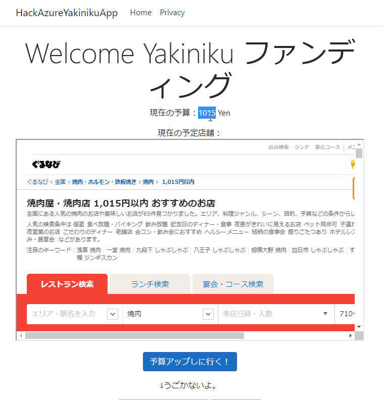

# hack1-yakiniku

- DBレスでクラウドファンディングを実現
- Payしていくことでやきにく予算がどんどん増えていくぞ！！

## 話題

- UIはSPAでよかったのでは？
- と考えると、今後YakinikuファンディングAPIを構築する構想が生まれる
- そうなってくると、さすがにサービス固有のDBがないのは難しそう

## Memo

- ./azure, ./.github 配下はゴミ（IaCしようとした名残）
